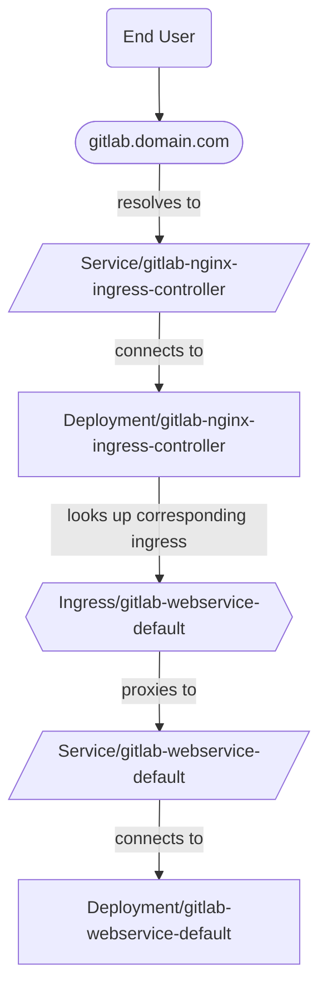



- Tier: Free, Premium, Ultimate
- Offering: GitLab Self-Managed



Deux méthodes prises en charge permettent de fournir l'Ingress dans OpenShift avec l'opérateur GitLab :

- [Contrôleur NGINX Ingress](#nginx-ingress-controller) (par défaut)
- [Routes OpenShift](#openshift-routes)

## Contrôleur NGINX Ingress {#nginx-ingress-controller}

Dans cette configuration, le trafic circule comme suit :



### Solution de contournement pour l'OpenShift Router qui remplace le contrôleur NGINX Ingress {#workaround-for-openshift-router-overriding-nginx-ingress-controller}

Dans un environnement OpenShift, les Ingresses GitLab peuvent recevoir le nom d'hôte
de l'instance GitLab au lieu de l'adresse IP externe du service NGINX.
Cela peut être observé dans la sortie de `kubectl get ingress -n <namespace>` dans la
colonne `ADDRESS`.

Le contrôleur OpenShift Router met à tort à jour la ressource Ingress
au lieu de l'ignorer en raison de la classe Ingress différente. La commande suivante
indique au contrôleur OpenShift Router d'ignorer correctement
les Ingresses autres que les Ingresses standard déployés dans OpenShift :

```shell
  kubectl -n openshift-ingress-operator \
    patch ingresscontroller default \
    --type merge \
    -p '{"spec":{"namespaceSelector":{"matchLabels":{"openshift.io/cluster-monitoring":"true"}}}}'
```

Si ce correctif est appliqué après que des Ingresses ont déjà été créés, supprimez-les manuellement.
L'opérateur GitLab les recrée manuellement. Ils devraient alors
être correctement gérés par le contrôleur NGINX Ingress et ignorés par l'OpenShift Router.

> [!note]
> Un bogue peut survenir lors de la suppression manuelle des Ingresses.
> La solution de contournement consiste à supprimer manuellement le pod du contrôleur de l'opérateur GitLab. Consultez
> [#315](https://gitlab.com/gitlab-org/cloud-native/gitlab-operator/-/issues/315)
> pour plus d'informations.

Pour le dépannage des problèmes liés aux SCC bloquant la création du contrôleur NGINX Ingress, consultez la documentation complémentaire dans notre [document de dépannage de l'opérateur](troubleshooting.md#openshift-specific-problems).

### Configuration {#configuration}

Par défaut, l'opérateur GitLab déploie le
[fork GitLab du chart du contrôleur NGINX Ingress](https://docs.gitlab.com/charts/charts/nginx/#adjustments-to-the-nginx-fork).

Pour utiliser le contrôleur NGINX Ingress, procédez comme suit :

1. Commencez par suivre la première étape des [instructions d'installation](installation.md) pour installer l'opérateur GitLab.
1. Recherchez le nom de domaine associé à la Route créée pour Webservice :

   ```plaintext
   $ kubectl get route -n openshift-console console -ojsonpath='{.status.ingress[0].host}'

   console-openshift-console.yourdomain.com
   ```

   Le domaine à utiliser à l'étape suivante correspond à la partie _après_ `console-openshift-console`.

1. À l'étape où le manifeste GitLab CR est créé, définissez le domaine comme suit :

   ```yaml
   spec:
     chart:
       values:
         global:
           # Configure the domain from the previous step.
           hosts:
             domain: yourdomain.com
   ```

   > [!note]
   > Par défaut, CertManager crée et gère les certificats TLS pour les Ingresses liés à GitLab.
   > Consultez la [documentation TLS](https://docs.gitlab.com/charts/installation/tls/) pour plus d'options.

1. Suivez le reste des instructions d'installation, appliquez le GitLab CR et confirmez que le statut du CR est finalement `Ready`.
1. Recherchez l'adresse IP externe du service du contrôleur NGINX Ingress (de type LoadBalancer) :

   ```plaintext
   $ kubectl get svc -n gitlab-system gitlab-nginx-ingress-controller -ojsonpath='{.status.loadBalancer.ingress[].ip}'

   11.22.33.444
   ```

1. Créez des enregistrements A auprès de votre fournisseur DNS pour associer le domaine et l'adresse IP externe des étapes précédentes :

   - `gitlab.yourdomain.com` -> `11.22.33.444`
   - `registry.yourdomain.com` -> `11.22.33.444`
   - `minio.yourdomain.com` -> `11.22.33.444`

   La création d'enregistrements A individuels plutôt qu'un enregistrement A générique garantit que les Routes existantes (telles que la Route du tableau de bord OpenShift)
   continuent de fonctionner comme prévu.

   > [!note]
   > Ces enregistrements doivent exister à la fois dans les zones **publiques** et **privées** des paramètres réseau de votre fournisseur cloud.
   > La parité entre ces zones assure un routage interne correct au cluster et permet à CertManager d'émettre correctement les certificats.

GitLab devrait alors être accessible à l'adresse `https://gitlab.yourdomain.com`.

## Routes OpenShift {#openshift-routes}

Par défaut, OpenShift utilise les
[Routes](https://docs.openshift.com/container-platform/4.10/networking/routes/route-configuration.html)
pour gérer l'Ingress.

Dans cette configuration, le trafic circule comme suit :


> [!note]
> L'utilisation des Routes OpenShift pour l'Ingress à la place du contrôleur NGINX Ingress signifie que [Git via SSH](git_over_ssh.md)
> n'est pas pris en charge.

### Configuration initiale {#setup}

Pour utiliser les Routes OpenShift pour l'Ingress, procédez comme suit :

1. Commencez par suivre la première étape des [instructions d'installation](installation.md) pour installer l'opérateur GitLab.
1. Recherchez le nom de domaine associé à la Route créée pour Webservice :

   ```plaintext
   $ kubectl get route -n openshift-console console -ojsonpath='{.status.ingress[0].host}'
   console-openshift-console.yourdomain.com
   ```

   Le domaine à utiliser à l'étape suivante correspond à la partie _après_ `console-openshift-console`.

1. À l'étape où le manifeste GitLab CR est créé, définissez également :

   ```yaml
   spec:
     chart:
       values:
         # Disable NGINX Ingress Controller.
         nginx-ingress:
           enabled: false
         global:
           # Configure the domain from the previous step.
           hosts:
             domain: yourdomain.com
           ingress:
             # Unset `spec.ingressClassName` on the Ingress objects
             # so the OpenShift Router takes ownership.
             class: none
             annotations:
               # The OpenShift documentation says "edge" is the default, but
               # the TLS configuration is only passed to the Route if this annotation
               # is manually set.
               route.openshift.io/termination: "edge"
   ```

   > [!note]
   > Par défaut, CertManager crée et gère les certificats TLS pour les Routes liées à GitLab.
   > Consultez la [documentation TLS](https://docs.gitlab.com/charts/installation/tls/) pour plus d'options.
   > Si le cluster OpenShift est sécurisé avec un certificat générique,
   > [l'option 2](https://docs.gitlab.com/charts/installation/tls/#option-2-use-your-own-wildcard-certificate)
   > permet au certificat générique de sécuriser les Routes liées à GitLab.

1. Suivez le reste des instructions d'installation, appliquez le GitLab CR et confirmez que le statut du CR est finalement `Ready`.

GitLab devrait alors être accessible à l'adresse `https://gitlab.yourdomain.com`.

Dans cette configuration, les Routes OpenShift sont créées en traduisant les Ingresses créés par l'opérateur GitLab.
Des informations complémentaires sur cette traduction sont disponibles dans la
[documentation des Routes](https://docs.openshift.com/container-platform/4.10/networking/routes/route-configuration.html#nw-ingress-creating-a-route-via-an-ingress_route-configuration).
