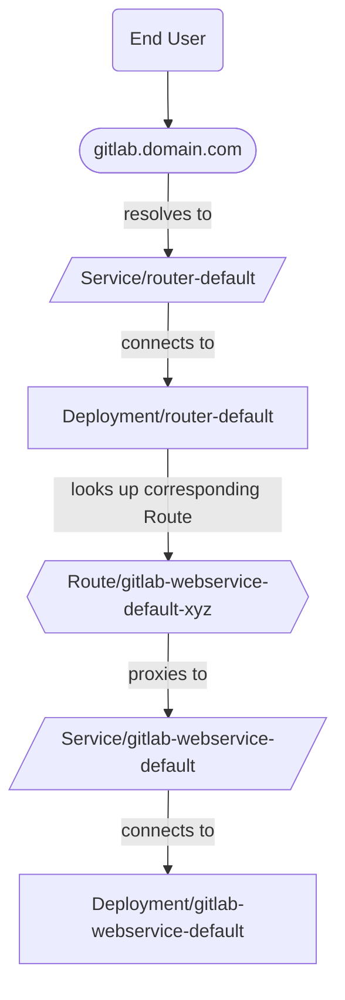



- Édition : version gratuite, GitLab Premium, GitLab Ultimate
- Offre : GitLab Self-Managed



Les méthodes suivantes permettent de gérer le routage du trafic dans OpenShift avec l'opérateur GitLab :

- [Gateway API avec Envoy Gateway](#gateway-api-with-envoy-gateway) (recommandé)
- [Contrôleur NGINX Ingress](#nginx-ingress-controller) (déprécié, sera supprimé dans GitLab 20.0)
- [Routes OpenShift](#openshift-routes)

## Gateway API avec Envoy Gateway {#gateway-api-with-envoy-gateway}

[Gateway API](https://gateway-api.sigs.k8s.io/) est l'approche recommandée pour le routage du trafic sur OpenShift. Elle est indépendante de la plateforme et prend en charge toutes les fonctionnalités de GitLab, y compris Git via SSH.

Pour obtenir des instructions de configuration détaillées et connaître les prérequis, consultez la [documentation Gateway API et Envoy Gateway](gatewayapi.md).

## Contrôleur NGINX Ingress {#nginx-ingress-controller}

> [!warning]
> NGINX Ingress est déprécié depuis le chart GitLab 19.0 et sera supprimé dans GitLab 20.0.
> Utilisez [Gateway API avec Envoy Gateway](#gateway-api-with-envoy-gateway) pour les nouveaux déploiements.

Dans cette configuration, le trafic circule comme suit :


### Solution de contournement pour le routeur OpenShift qui remplace le contrôleur NGINX Ingress {#workaround-for-openshift-router-overriding-nginx-ingress-controller}

Dans un environnement OpenShift, les Ingresses GitLab peuvent recevoir le nom d'hôte de l'instance GitLab au lieu de l'adresse IP externe du service NGINX. Vous pouvez le constater dans les données de sortie de `kubectl get ingress -n <namespace>` dans la colonne `ADDRESS`.

Le contrôleur du routeur OpenShift met à jour de manière incorrecte la ressource Ingress au lieu de l'ignorer en raison de la différence de classe Ingress. La commande suivante demande au contrôleur du routeur OpenShift d'ignorer correctement les Ingresses autres que les Ingresses standard déployés dans OpenShift :

```shell
  kubectl -n openshift-ingress-operator \
    patch ingresscontroller default \
    --type merge \
    -p '{"spec":{"namespaceSelector":{"matchLabels":{"openshift.io/cluster-monitoring":"true"}}}}'
```

Si ce correctif est appliqué après que des Ingresses ont déjà été créés, supprimez manuellement les Ingresses. L'opérateur GitLab les recrée manuellement. Ils devraient être correctement pris en charge par le contrôleur NGINX Ingress et ignorés par le routeur OpenShift.

> [!note]
> Un bogue peut survenir lors de la suppression manuelle des Ingresses. La solution de contournement consiste à supprimer manuellement le pod du contrôleur de l'opérateur GitLab. Consultez [le ticket 315](https://gitlab.com/gitlab-org/cloud-native/gitlab-operator/-/issues/315) pour plus d'informations.

Pour résoudre les problèmes liés aux contraintes de contexte de sécurité (SCC) qui bloquent la création du contrôleur NGINX Ingress, consultez la documentation supplémentaire dans notre [documentation de dépannage de l'opérateur GitLab](troubleshooting.md#openshift-specific-problems).

### Configuration {#configuration}

Par défaut, l'opérateur GitLab déploie la [duplication GitLab du chart du contrôleur NGINX Ingress](https://docs.gitlab.com/charts/charts/nginx/#adjustments-to-the-nginx-fork).

Pour utiliser le contrôleur NGINX Ingress pour Ingress, procédez comme suit :

1. Commencez par suivre la première étape des [instructions d'installation](installation.md) pour installer l'opérateur GitLab.
1. Trouvez le nom de domaine associé à la route créée pour Webservice :

   ```plaintext
   $ kubectl get route -n openshift-console console -ojsonpath='{.status.ingress[0].host}'

   console-openshift-console.yourdomain.com
   ```

   Le domaine à utiliser à l'étape suivante est la partie _après_ `console-openshift-console`.

1. À l'étape où le manifeste de la ressource personnalisée GitLab est créé, définissez le domaine comme suit :

   ```yaml
   spec:
     chart:
       values:
         global:
           # Configure the domain from the previous step.
           hosts:
             domain: yourdomain.com
   ```

   > [!note]
   > Par défaut, CertManager crée et gère les certificats TLS pour les Ingresses liés à GitLab. Consultez la [documentation TLS](https://docs.gitlab.com/charts/installation/tls/) pour plus d'options.

1. Suivez le reste des instructions d'installation, en appliquant la ressource personnalisée GitLab et en confirmant que le statut de la ressource personnalisée est `Ready`.
1. Trouvez l'adresse IP externe du service du contrôleur NGINX Ingress (de type LoadBalancer) :

   ```plaintext
   $ kubectl get svc -n gitlab-system gitlab-nginx-ingress-controller -ojsonpath='{.status.loadBalancer.ingress[].ip}'

   11.22.33.444
   ```

1. Créez des enregistrements A dans votre fournisseur DNS pour connecter le domaine et l'adresse IP externe des étapes précédentes :

   - `gitlab.yourdomain.com` -> `11.22.33.444`
   - `registry.yourdomain.com` -> `11.22.33.444`
   - `minio.yourdomain.com` -> `11.22.33.444`

   La création d'enregistrements A individuels plutôt qu'un enregistrement A générique garantit que les routes existantes (comme la route pour le tableau de bord OpenShift) continuent de fonctionner comme prévu.

   > [!note]
   > Ces enregistrements doivent exister dans _les deux_ zones publique **et** privée dans les paramètres réseau de votre fournisseur cloud. La parité entre ces zones garantit un routage interne au cluster approprié et permet à CertManager d'émettre correctement les certificats.

GitLab devrait alors être disponible à l'adresse `https://gitlab.yourdomain.com`.

## Routes OpenShift {#openshift-routes}

Par défaut, OpenShift utilise les [routes](https://docs.openshift.com/container-platform/4.10/networking/routes/route-configuration.html) pour gérer Ingress.

Dans cette configuration, le trafic circule comme suit :



> [!note]
> L'utilisation des routes pour Ingress à la place du contrôleur NGINX Ingress signifie que [Git via SSH](git_over_ssh.md) n'est pas pris en charge.

### Mise en place {#setup}

Pour utiliser les routes OpenShift pour Ingress, procédez comme suit :

1. Commencez par suivre la première étape des [instructions d'installation](installation.md) pour installer l'opérateur GitLab.
1. Trouvez le nom de domaine associé à la route créée pour Webservice :

   ```plaintext
   $ kubectl get route -n openshift-console console -ojsonpath='{.status.ingress[0].host}'
   console-openshift-console.yourdomain.com
   ```

   Le domaine à utiliser à l'étape suivante est la partie _après_ `console-openshift-console`.

1. À l'étape où le manifeste de la ressource personnalisée GitLab est créé, définissez également :

   ```yaml
   spec:
     chart:
       values:
         # Disable NGINX Ingress Controller.
         nginx-ingress:
           enabled: false
         global:
           # Configure the domain from the previous step.
           hosts:
             domain: yourdomain.com
           ingress:
             # Unset `spec.ingressClassName` on the Ingress objects
             # so the OpenShift Router takes ownership.
             class: none
             annotations:
               # The OpenShift documentation says "edge" is the default, but
               # the TLS configuration is only passed to the Route if this annotation
               # is manually set.
               route.openshift.io/termination: "edge"
   ```

   > [!note]
   > Par défaut, CertManager crée et gère les certificats TLS pour les routes liées à GitLab. Consultez la [documentation TLS](https://docs.gitlab.com/charts/installation/tls/) pour plus d'options. Si le cluster OpenShift est sécurisé avec un certificat générique, l'[option 2](https://docs.gitlab.com/charts/installation/tls/#option-2-use-your-own-wildcard-certificate) permet au certificat générique de sécuriser les routes liées à GitLab.

1. Suivez le reste des instructions d'installation, en appliquant la ressource personnalisée GitLab et en confirmant que le statut de la ressource personnalisée est `Ready`.

GitLab devrait alors être disponible à l'adresse `https://gitlab.yourdomain.com`.

Dans cette configuration, les routes OpenShift sont créées en traduisant les Ingresses créés par l'opérateur GitLab. Plus d'informations sur cette traduction sont disponibles dans la [documentation des routes](https://docs.openshift.com/container-platform/4.10/networking/routes/route-configuration.html#nw-ingress-creating-a-route-via-an-ingress_route-configuration).
