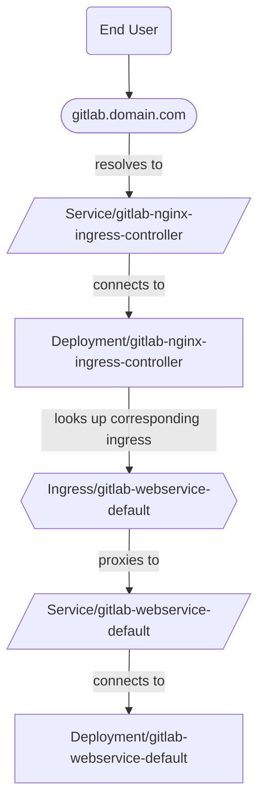



- プラン: Free、Premium、Ultimate
- 提供形態: GitLab Self-Managed



OpenShiftでGitLab Operatorを使用してIngressを提供するためにサポートされている方法は2つあります:

- [NGINX Ingress Controller](#nginx-ingress-controller)（デフォルト）
- [OpenShift Routes](#openshift-routes)

## NGINX Ingress Controller {#nginx-ingress-controller}

この設定では、トラフィックは次のように流れます:



### OpenShift RouterがNGINX Ingress Controllerをオーバーライドする場合の回避策 {#workaround-for-openshift-router-overriding-nginx-ingress-controller}

OpenShift環境では、GitLabのIngressは、NGINXサービスの外部IPアドレスではなく、GitLabインスタンスのホスト名を受信する場合があります。これは、`kubectl get ingress -n <namespace>`の出力の`ADDRESS`列に表示されます。

OpenShift Routerコントローラーは、Ingressクラスが異なるため、Ingressリソースを無視する代わりに、誤って更新します。次のコマンドは、OpenShift Routerコントローラーに対し、OpenShiftにデプロイされた標準Ingress以外のIngressを適切に無視するように指示します:

```shell
  kubectl -n openshift-ingress-operator \
    patch ingresscontroller default \
    --type merge \
    -p '{"spec":{"namespaceSelector":{"matchLabels":{"openshift.io/cluster-monitoring":"true"}}}}'
```

このパッチがIngressの作成後に適用された場合は、Ingressを手動で削除してください。GitLab Operatorはそれらを手動で再作成します。それらは、NGINX Ingressコントローラーによって適切に所有され、OpenShift Routerによって無視される必要があります。



Ingressを手動で削除すると、バグが発生する可能性があります。回避策として、GitLab Operatorコントローラーポッドを手動で削除します。詳細については、[\#315](https://gitlab.com/gitlab-org/cloud-native/gitlab-operator/-/issues/315)を参照してください。



NGINX Ingressコントローラーの作成をブロックするSCC関連のイシューのトラブルシューティングについては、[Operatorトラブルシューティングドキュメント](troubleshooting.md#openshift-specific-problems)の追加のドキュメントを参照してください。

### 設定 {#configuration}

デフォルトでは、GitLab Operatorは、[GitLabのNGINX Ingressコントローラーチャートのフォーク](https://docs.gitlab.com/charts/charts/nginx/#adjustments-to-the-nginx-fork)をデプロイします。

IngressにNGINX Ingressコントローラーを使用するには、以下を完了します:

1. GitLab Operatorをインストールするには、[インストール手順](installation.md)の最初の手順に従って開始します。
1. Webservice用に作成されたRouteに関連付けられているドメイン名を見つけます:

   ```plaintext
   $ kubectl get route -n openshift-console console -ojsonpath='{.status.ingress[0].host}'

   console-openshift-console.yourdomain.com
   ```

   次のステップで使用するドメインは、`console-openshift-console` _after_の部分です。

1. GitLab CRマニフェストが作成されるステップで、次のようにドメインを設定します:

   ```yaml
   spec:
     chart:
       values:
         global:
           # Configure the domain from the previous step.
           hosts:
             domain: yourdomain.com
   ```

   

   デフォルトでは、CertManagerはGitLab関連のIngressのTLS証明書を作成および管理します。その他のオプションについては、[TLSドキュメント](https://docs.gitlab.com/charts/installation/tls/)を参照してください。

   

1. 残りのインストール手順に従ってGitLab CRを適用し、CRステータスが最終的に`Ready`になることを確認します。
1. NGINX IngressコントローラーのService（LoadBalancerのタイプ）の外部IPアドレスを見つけます:

   ```plaintext
   $ kubectl get svc -n gitlab-system gitlab-nginx-ingress-controller -ojsonpath='{.status.loadBalancer.ingress[].ip}'

   11.22.33.444
   ```

1. DNSプロバイダーでAレコードを作成し、ドメインと前の手順からの外部IPアドレスを接続します:

   - `gitlab.yourdomain.com` -> `11.22.33.444`
   - `registry.yourdomain.com` -> `11.22.33.444`
   - `minio.yourdomain.com` -> `11.22.33.444`

   ワイルドカードAレコードではなく個々のAレコードを作成することで、既存のRoute（OpenShiftダッシュボードのRouteなど）が期待どおりに動作し続けることが保証されます。

   

   これらのレコードは、クラウドプロバイダーのネットワーク設定のパブリックゾーン_both_**と**プライベートゾーンに存在する必要があります。これらのゾーン間の同等性により、適切なクラスター内部ルーティングが保証され、CertManagerが証明書を適切に発行できるようになります。

   

GitLabは、`https://gitlab.yourdomain.com`で利用できるようになります。

## OpenShift Routes {#openshift-routes}

デフォルトでは、OpenShiftは[Routes](https://docs.openshift.com/container-platform/4.10/networking/routes/route-configuration.html)を使用してIngressを管理します。

この設定では、トラフィックは次のように流れます:




NGINX Ingressコントローラーの代わりにIngressにRoutesを使用するということは、[Git over SSH](git_over_ssh.md)がサポートされていないことを意味します。



### セットアップ {#setup}

IngressにOpenShift Routesを使用するには、以下を完了します:

1. GitLab Operatorをインストールするには、[インストール手順](installation.md)の最初の手順に従って開始します。
1. Webservice用に作成されたRouteに関連付けられているドメイン名を見つけます:

   ```plaintext
   $ kubectl get route -n openshift-console console -ojsonpath='{.status.ingress[0].host}'
   console-openshift-console.yourdomain.com
   ```

   次のステップで使用するドメインは、`console-openshift-console` _after_の部分です。

1. GitLab CRマニフェストが作成されるステップで、以下も設定します:

   ```yaml
   spec:
     chart:
       values:
         # Disable NGINX Ingress Controller.
         nginx-ingress:
           enabled: false
         global:
           # Configure the domain from the previous step.
           hosts:
             domain: yourdomain.com
           ingress:
             # Unset `spec.ingressClassName` on the Ingress objects
             # so the OpenShift Router takes ownership.
             class: none
             annotations:
               # The OpenShift documentation says "edge" is the default, but
               # the TLS configuration is only passed to the Route if this annotation
               # is manually set.
               route.openshift.io/termination: "edge"
   ```

   

   デフォルトでは、CertManagerはGitLab関連のRoutesのTLS証明書を作成および管理します。その他のオプションについては、[TLSドキュメント](https://docs.gitlab.com/charts/installation/tls/)を参照してください。OpenShiftクラスターがワイルドカード証明書で保護されている場合、[オプション2](https://docs.gitlab.com/charts/installation/tls/#option-2-use-your-own-wildcard-certificate)を使用すると、ワイルドカード証明書でGitLab関連のRoutesを保護できます。

   

1. 残りのインストール手順に従ってGitLab CRを適用し、CRステータスが最終的に`Ready`になることを確認します。

GitLabは、`https://gitlab.yourdomain.com`で利用できるようになります。

この設定では、OpenShift Routeは、GitLab Operatorによって作成されたIngressを変換することによって作成されます。この変換の詳細については、[Routeドキュメント](https://docs.openshift.com/container-platform/4.10/networking/routes/route-configuration.html#nw-ingress-creating-a-route-via-an-ingress_route-configuration)を参照してください。
