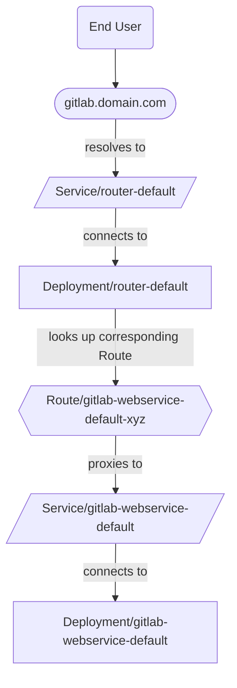



- プラン: Free、Premium、Ultimate
- 提供形態: GitLab Self-Managed



GitLab OperatorでOpenShiftにおけるトラフィックルーティングを提供するためにサポートされている方法は、次のとおりです:

- [Gateway APIとEnvoy Gateway](#gateway-api-with-envoy-gateway)（推奨）
- [NGINX Ingress Controller](#nginx-ingress-controller)（非推奨、GitLab 20.0で削除予定）
- [OpenShift Routes](#openshift-routes)

## Gateway APIとEnvoy Gateway {#gateway-api-with-envoy-gateway}

[Gateway API](https://gateway-api.sigs.k8s.io/)は、OpenShiftにおけるトラフィックルーティングに推奨されるアプローチです。プラットフォームに依存せず、Git over SSHを含むすべてのGitLab機能をサポートしています。

詳細な設定手順と前提条件については、[Gateway APIとEnvoy Gatewayのドキュメント](gatewayapi.md)を参照してください。

## NGINX Ingress Controller {#nginx-ingress-controller}

> [!warning]
> NGINX IngressはGitLabチャート19.0で非推奨となり、GitLab 20.0で削除される予定です。
> 新規デプロイには[Gateway APIとEnvoy Gateway](#gateway-api-with-envoy-gateway)を使用してください。

この構成では、トラフィックは次のように流れます:


### OpenShift RouterがNGINX Ingress Controllerをオーバーライドする場合の回避策 {#workaround-for-openshift-router-overriding-nginx-ingress-controller}

OpenShift環境では、GitLab Ingressが、NGINX Serviceの外部IPアドレスではなくGitLabインスタンスのホスト名を受け取る場合があります。これは、`kubectl get ingress -n <namespace>`の出力の`ADDRESS`列に表示されます。

これは、Ingressクラスが異なるため本来無視すべきIngressリソースを、OpenShift Routerコントローラーが誤って更新してしまうために発生します。次のコマンドは、OpenShift Routerコントローラーに対し、OpenShiftにデプロイされた標準Ingress以外のIngressを適切に無視するように指示します:

```shell
  kubectl -n openshift-ingress-operator \
    patch ingresscontroller default \
    --type merge \
    -p '{"spec":{"namespaceSelector":{"matchLabels":{"openshift.io/cluster-monitoring":"true"}}}}'
```

Ingressがすでに作成された後にこのパッチを適用した場合は、Ingressを手動で削除してください。GitLab Operatorがそれらを手動で再作成します。その後、それらのIngressはNGINX Ingress Controllerによって適切に所有され、OpenShift Routerからは無視されるようになります。

> [!note]
> Ingressを手動で削除する際に、バグが発生する可能性があります。回避策は、GitLab Operatorコントローラーポッドを手動で削除することです。詳細については、[#315](https://gitlab.com/gitlab-org/cloud-native/gitlab-operator/-/issues/315)を参照してください。

NGINX Ingress Controllerの作成を妨げるSCC関連の問題のトラブルシューティングについては、[Operatorトラブルシューティングドキュメント](troubleshooting.md#openshift-specific-problems)の追加ドキュメントを参照してください。

### 設定 {#configuration}

デフォルトでは、GitLab Operatorは、GitLabが[フォークしたNGINX Ingress Controllerチャート](https://docs.gitlab.com/charts/charts/nginx/#adjustments-to-the-nginx-fork)をデプロイします。

IngressにNGINX Ingress Controllerを使用するには、次の手順を実行します:

1. [インストール手順](installation.md)の最初のステップに従って、GitLab Operatorをインストールします。
1. Webservice用に作成されたRouteに関連付けられているドメイン名を確認します:

   ```plaintext
   $ kubectl get route -n openshift-console console -ojsonpath='{.status.ingress[0].host}'

   console-openshift-console.yourdomain.com
   ```

   次のステップで使用するドメインは、`console-openshift-console`より_後_の部分です。

1. GitLab CRマニフェストを作成するステップで、次のようにドメインを設定します:

   ```yaml
   spec:
     chart:
       values:
         global:
           # Configure the domain from the previous step.
           hosts:
             domain: yourdomain.com
   ```

   > [!note]
   > デフォルトでは、CertManagerがGitLab関連のIngressのTLS証明書を作成および管理します。その他のオプションについては、[TLSドキュメント](https://docs.gitlab.com/charts/installation/tls/)を参照してください。

1. 残りのインストール手順に従ってGitLab CRを適用し、最終的にCRのステータスが`Ready`になることを確認します。
1. NGINX Ingress ControllerのService（LoadBalancerタイプ）の外部IPアドレスを確認します:

   ```plaintext
   $ kubectl get svc -n gitlab-system gitlab-nginx-ingress-controller -ojsonpath='{.status.loadBalancer.ingress[].ip}'

   11.22.33.444
   ```

1. DNSプロバイダーでAレコードを作成し、ドメインと前のステップで確認した外部IPアドレスを関連付けます:

   - `gitlab.yourdomain.com` -> `11.22.33.444`
   - `registry.yourdomain.com` -> `11.22.33.444`
   - `minio.yourdomain.com` -> `11.22.33.444`

   ワイルドカードAレコードではなく個別のAレコードを作成することで、既存のRoute（OpenShiftダッシュボード用のRouteなど）が想定どおりに引き続き動作することが保証されます。

   > [!note]
   > これらのレコードは、クラウドプロバイダーのネットワーク設定で、パブリック**と**プライベートの_両方の_ゾーンに存在する必要があります。これらのゾーン間で同等性を保つことで、クラスター内部のルーティングが適切に行われ、CertManagerが証明書を適切に発行できるようになります。

その後、`https://gitlab.yourdomain.com`でGitLabを利用できるようになります。

## OpenShift Routes {#openshift-routes}

デフォルトでは、OpenShiftは[Routes](https://docs.openshift.com/container-platform/4.10/networking/routes/route-configuration.html)を使用してIngressを管理します。

この構成では、トラフィックは次のように流れます:



> [!note]
> NGINX Ingress Controllerの代わりにRouteをIngressに使用すると、[Git over SSH](git_over_ssh.md)はサポートされません。

### セットアップ {#setup}

IngressにOpenShift Routesを使用するには、次の手順を実行します:

1. [インストール手順](installation.md)の最初のステップに従って、GitLab Operatorをインストールします。
1. Webservice用に作成されたRouteに関連付けられているドメイン名を確認します:

   ```plaintext
   $ kubectl get route -n openshift-console console -ojsonpath='{.status.ingress[0].host}'
   console-openshift-console.yourdomain.com
   ```

   次のステップで使用するドメインは、`console-openshift-console`より_後_の部分です。

1. GitLab CRマニフェストを作成するステップで、以下も設定します:

   ```yaml
   spec:
     chart:
       values:
         # Disable NGINX Ingress Controller.
         nginx-ingress:
           enabled: false
         global:
           # Configure the domain from the previous step.
           hosts:
             domain: yourdomain.com
           ingress:
             # Unset `spec.ingressClassName` on the Ingress objects
             # so the OpenShift Router takes ownership.
             class: none
             annotations:
               # The OpenShift documentation says "edge" is the default, but
               # the TLS configuration is only passed to the Route if this annotation
               # is manually set.
               route.openshift.io/termination: "edge"
   ```

   > [!note]
   > デフォルトでは、CertManagerがGitLab関連のRouteのTLS証明書を作成および管理します。その他のオプションについては、[TLSドキュメント](https://docs.gitlab.com/charts/installation/tls/)を参照してください。OpenShiftクラスターがワイルドカード証明書で保護されている場合、[オプション2](https://docs.gitlab.com/charts/installation/tls/#option-2-use-your-own-wildcard-certificate)では、そのワイルドカード証明書でGitLab関連のRoutesを保護できます。

1. 残りのインストール手順に従ってGitLab CRを適用し、最終的にCRのステータスが`Ready`になることを確認します。

その後、`https://gitlab.yourdomain.com`でGitLabを利用できるようになります。

この設定では、GitLab Operatorが作成したIngressを変換してOpenShift Routesが作成されます。この変換の詳細については、[Routeドキュメント](https://docs.openshift.com/container-platform/4.10/networking/routes/route-configuration.html#nw-ingress-creating-a-route-via-an-ingress_route-configuration)を参照してください。
