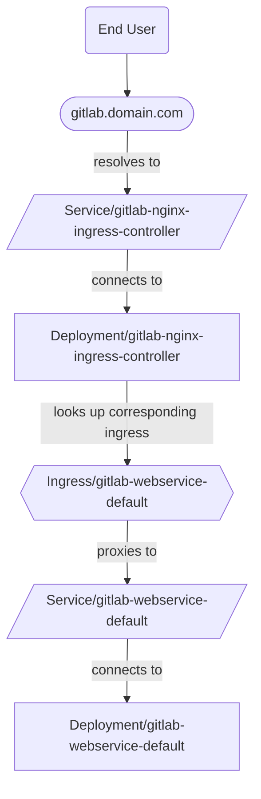



- Tier: Free, 프리미엄, Ultimate
- Offering: GitLab Self-Managed



GitLab Operator를 사용하여 OpenShift에서 Ingress를 제공하는 두 가지 지원 방법이 있습니다:

- [NGINX Ingress Controller](#nginx-ingress-controller) (기본값)
- [OpenShift Routes](#openshift-routes)

## NGINX Ingress Controller {#nginx-ingress-controller}

이 구성에서 트래픽 흐름은 다음과 같습니다:



### NGINX Ingress Controller를 재정의하는 OpenShift Router에 대한 해결 방법 {#workaround-for-openshift-router-overriding-nginx-ingress-controller}

OpenShift 환경에서 GitLab Ingress는 NGINX 서비스의 외부 IP 주소 대신
GitLab 인스턴스의 호스트명을 받을 수 있습니다.
이는 `kubectl get ingress -n <namespace>` 명령의 출력에서
`ADDRESS` 열을 통해 확인할 수 있습니다.

OpenShift Router 컨트롤러가 다른 Ingress 클래스임에도 불구하고 Ingress 리소스를
무시하지 않고 잘못 업데이트합니다. 다음 명령을 실행하면 OpenShift Router 컨트롤러가
OpenShift에 배포된 표준 Ingress 이외의 Ingress를 올바르게 무시하도록 설정됩니다:

```shell
  kubectl -n openshift-ingress-operator \
    patch ingresscontroller default \
    --type merge \
    -p '{"spec":{"namespaceSelector":{"matchLabels":{"openshift.io/cluster-monitoring":"true"}}}}'
```

Ingress가 이미 생성된 후에 이 패치를 적용하는 경우, Ingress를 수동으로 삭제하세요.
GitLab Operator가 이를 자동으로 재생성합니다. 재생성된 Ingress는
NGINX Ingress Controller에 의해 올바르게 소유되고 OpenShift Router에 의해 무시됩니다.

> [!note]
> Ingress를 수동으로 삭제할 때 버그가 발생할 수 있습니다.
> 해결 방법은 GitLab Operator 컨트롤러 Pod를 수동으로 삭제하는 것입니다. 자세한 내용은
> [#315](https://gitlab.com/gitlab-org/cloud-native/gitlab-operator/-/issues/315)를
> 참조하세요.

NGINX Ingress Controller 생성을 차단하는 SCC 관련 문제 해결에 대해서는 [Operator 문제 해결 문서](troubleshooting.md#openshift-specific-problems)의 추가 문서를 참조하세요.

### 구성 {#configuration}

기본적으로 GitLab Operator는 GitLab의
[NGINX Ingress Controller 차트 포크](https://docs.gitlab.com/charts/charts/nginx/#adjustments-to-the-nginx-fork)를 배포합니다.

Ingress에 NGINX Ingress Controller를 사용하려면 다음 단계를 완료하세요:

1. [설치 지침](installation.md)의 첫 번째 단계에 따라 GitLab Operator를 설치하세요.
1. Webservice용으로 생성된 Route와 연결된 도메인 이름을 찾으세요:

   ```plaintext
   $ kubectl get route -n openshift-console console -ojsonpath='{.status.ingress[0].host}'

   console-openshift-console.yourdomain.com
   ```

   다음 단계에서 사용할 도메인은 `console-openshift-console` _이후_ 부분입니다.

1. GitLab CR 매니페스트를 생성하는 단계에서 도메인을 다음과 같이 설정하세요:

   ```yaml
   spec:
     chart:
       values:
         global:
           # Configure the domain from the previous step.
           hosts:
             domain: yourdomain.com
   ```

   > [!note]
   > 기본적으로 CertManager는 GitLab 관련 Ingress에 대한 TLS 인증서를 생성하고 관리합니다.
   > 더 많은 옵션은 [TLS 문서](https://docs.gitlab.com/charts/installation/tls/)를 참조하세요.

1. 나머지 설치 지침에 따라 GitLab CR을 적용하고 CR 상태가 최종적으로 `Ready`가 되는지 확인하세요.
1. NGINX Ingress Controller 서비스(LoadBalancer 유형)의 외부 IP 주소를 찾으세요:

   ```plaintext
   $ kubectl get svc -n gitlab-system gitlab-nginx-ingress-controller -ojsonpath='{.status.loadBalancer.ingress[].ip}'

   11.22.33.444
   ```

1. DNS 공급자에서 A 레코드를 생성하여 이전 단계의 도메인과 외부 IP 주소를 연결하세요:

   - `gitlab.yourdomain.com` -> `11.22.33.444`
   - `registry.yourdomain.com` -> `11.22.33.444`
   - `minio.yourdomain.com` -> `11.22.33.444`

   와일드카드 A 레코드 대신 개별 A 레코드를 생성하면 기존 Route(예: OpenShift
   대시보드용 Route)가 계속 정상적으로 작동합니다.

   > [!note]
   > 이 레코드는 클라우드 공급자의 네트워크 설정에서 공개 영역과 비공개 영역 _모두_에 존재해야 합니다.
   > 두 영역 간의 일관성을 유지하면 클러스터 내부 라우팅이 올바르게 작동하고 CertManager가 인증서를 올바르게 발급할 수 있습니다.

그러면 GitLab은 `https://gitlab.yourdomain.com`에서 사용할 수 있습니다.

## OpenShift Routes {#openshift-routes}

기본적으로 OpenShift는
[Routes](https://docs.openshift.com/container-platform/4.10/networking/routes/route-configuration.html)를
사용하여 Ingress를 관리합니다.

이 구성에서 트래픽 흐름은 다음과 같습니다:


> [!note]
> NGINX Ingress Controller 대신 Routes를 Ingress에 사용하면 [SSH를 통한 Git](git_over_ssh.md)이
> 지원되지 않습니다.

### 설정 {#setup}

Ingress에 OpenShift Routes를 사용하려면 다음 단계를 완료하세요:

1. [설치 지침](installation.md)의 첫 번째 단계에 따라 GitLab Operator를 설치하세요.
1. Webservice용으로 생성된 Route와 연결된 도메인 이름을 찾으세요:

   ```plaintext
   $ kubectl get route -n openshift-console console -ojsonpath='{.status.ingress[0].host}'
   console-openshift-console.yourdomain.com
   ```

   다음 단계에서 사용할 도메인은 `console-openshift-console` _이후_ 부분입니다.

1. GitLab CR 매니페스트를 생성하는 단계에서 다음도 설정하세요:

   ```yaml
   spec:
     chart:
       values:
         # Disable NGINX Ingress Controller.
         nginx-ingress:
           enabled: false
         global:
           # Configure the domain from the previous step.
           hosts:
             domain: yourdomain.com
           ingress:
             # Unset `spec.ingressClassName` on the Ingress objects
             # so the OpenShift Router takes ownership.
             class: none
             annotations:
               # The OpenShift documentation says "edge" is the default, but
               # the TLS configuration is only passed to the Route if this annotation
               # is manually set.
               route.openshift.io/termination: "edge"
   ```

   > [!note]
   > 기본적으로 CertManager는 GitLab 관련 Route에 대한 TLS 인증서를 생성하고 관리합니다.
   > 더 많은 옵션은 [TLS 문서](https://docs.gitlab.com/charts/installation/tls/)를 참조하세요.
   > OpenShift 클러스터가 와일드카드 인증서로 보호되는 경우,
   > [옵션 2](https://docs.gitlab.com/charts/installation/tls/#option-2-use-your-own-wildcard-certificate)를
   > 사용하면 와일드카드 인증서로 GitLab 관련 Route를 보호할 수 있습니다.

1. 나머지 설치 지침에 따라 GitLab CR을 적용하고 CR 상태가 최종적으로 `Ready`가 되는지 확인하세요.

그러면 GitLab은 `https://gitlab.yourdomain.com`에서 사용할 수 있습니다.

이 구성에서 OpenShift Routes는 GitLab Operator가 생성한 Ingress를 변환하여 생성됩니다.
이 변환에 대한 자세한 내용은
[Route 문서](https://docs.openshift.com/container-platform/4.10/networking/routes/route-configuration.html#nw-ingress-creating-a-route-via-an-ingress_route-configuration)에서 확인할 수 있습니다.
