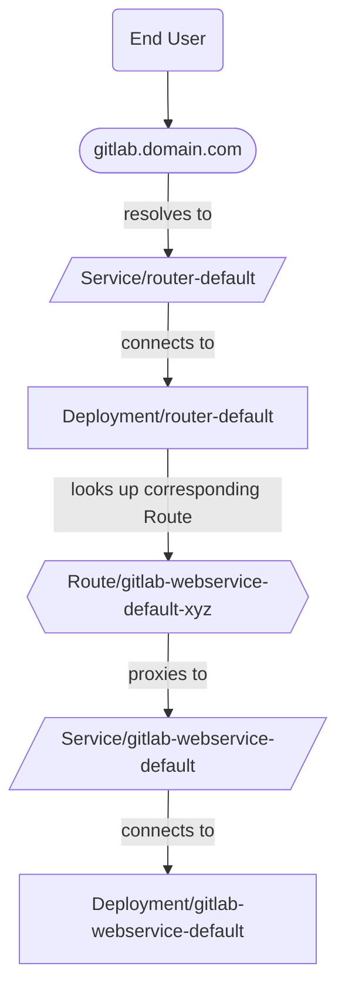



- 계층:  Free, Premium, Ultimate
- 제공:  GitLab Self-Managed



GitLab Operator로 OpenShift에서 트래픽 라우팅을 제공하기 위한 방법은 다음과 같습니다:

- [Gateway API with Envoy Gateway](#gateway-api-with-envoy-gateway) (권장)
- [NGINX Ingress Controller](#nginx-ingress-controller) (더 이상 사용되지 않으며 GitLab 20.0에서 제거 예정)
- [OpenShift Routes](#openshift-routes)

## Gateway API with Envoy Gateway {#gateway-api-with-envoy-gateway}

[Gateway API](https://gateway-api.sigs.k8s.io/)는 OpenShift에서 트래픽 라우팅을 위한 권장 방법입니다. 플랫폼에 독립적이며 Git over SSH를 포함한 모든 GitLab 기능을 지원합니다.

자세한 구성 지침 및 사전 요구 사항은 [Gateway API and Envoy Gateway 문서](gatewayapi.md)를 참조하세요.

## NGINX Ingress Controller {#nginx-ingress-controller}

> [!warning]
> NGINX Ingress는 GitLab 차트 19.0부터 더 이상 사용되지 않으며 GitLab 20.0에서 제거될 예정입니다.
> 새 배포에는 [Gateway API with Envoy Gateway](#gateway-api-with-envoy-gateway)를 사용하세요.

이 구성에서 트래픽은 다음과 같이 흐릅니다:


### OpenShift Router가 NGINX Ingress Controller를 재정의하는 경우 해결 방법 {#workaround-for-openshift-router-overriding-nginx-ingress-controller}

OpenShift 환경에서 GitLab Ingress는 NGINX Service의 외부 IP 주소 대신 GitLab 인스턴스의 호스트명을 받을 수 있습니다. 이는 `kubectl get ingress -n <namespace>`의 출력에서 `ADDRESS` 열에서 볼 수 있습니다.

OpenShift Router 컨트롤러는 다른 Ingress 클래스로 인해 Ingress를 무시하지 않고 잘못 업데이트합니다. 다음 명령은 OpenShift Router 컨트롤러에 OpenShift에 배포된 표준 Ingress 이외의 다른 Ingress를 올바르게 무시하도록 지시합니다:

```shell
  kubectl -n openshift-ingress-operator \
    patch ingresscontroller default \
    --type merge \
    -p '{"spec":{"namespaceSelector":{"matchLabels":{"openshift.io/cluster-monitoring":"true"}}}}'
```

Ingress를 이미 생성한 후 이 패치를 적용하면 Ingress를 수동으로 삭제하십시오. GitLab Operator가 수동으로 다시 생성합니다. 이들은 NGINX Ingress Controller에서 올바르게 소유되어야 하고 OpenShift Router에서 무시되어야 합니다.

> [!note]
> Ingress를 수동으로 삭제할 때 버그가 발생할 수 있습니다. 해결 방법은 GitLab Operator 컨트롤러 Pod를 수동으로 삭제하는 것입니다. 자세한 내용은 [\#315](https://gitlab.com/gitlab-org/cloud-native/gitlab-operator/-/issues/315)를 참조하세요.

NGINX-Ingress Controller 생성을 차단하는 SCC 관련 문제 해결을 위해 [Operator Troubleshooting 문서](troubleshooting.md#openshift-specific-problems)에서 추가 문서를 참조하세요.

### 구성 {#configuration}

기본적으로 GitLab Operator는 GitLab [NGINX Ingress Controller 차트의 포크](https://docs.gitlab.com/charts/charts/nginx/#adjustments-to-the-nginx-fork)를 배포합니다.

Ingress에 NGINX Ingress Controller를 사용하려면 다음을 완료하십시오:

1. [설치 지침](installation.md)의 첫 번째 단계를 따르면서 시작하여 GitLab Operator를 설치합니다.
1. Webservice에 대해 생성된 Route와 관련된 도메인 이름을 찾습니다:

   ```plaintext
   $ kubectl get route -n openshift-console console -ojsonpath='{.status.ingress[0].host}'

   console-openshift-console.yourdomain.com
   ```

   다음 단계에서 사용할 도메인은 _after_ `console-openshift-console`부터의 부분입니다.

1. GitLab CR 매니페스트가 생성되는 단계에서 도메인을 다음과 같이 설정합니다:

   ```yaml
   spec:
     chart:
       values:
         global:
           # Configure the domain from the previous step.
           hosts:
             domain: yourdomain.com
   ```

   > [!note]
   > 기본적으로 CertManager는 GitLab 관련 Ingress에 대한 TLS 인증서를 생성하고 관리합니다. [TLS 문서](https://docs.gitlab.com/charts/installation/tls/)를 참조하여 더 많은 옵션을 확인하세요.

1. 설치 지침의 나머지 부분을 따르고 GitLab CR을 적용하며 CR 상태가 결국 `Ready`인지 확인합니다.
1. NGINX Ingress Controller의 Service(LoadBalancer 유형)의 외부 IP 주소를 찾습니다:

   ```plaintext
   $ kubectl get svc -n gitlab-system gitlab-nginx-ingress-controller -ojsonpath='{.status.loadBalancer.ingress[].ip}'

   11.22.33.444
   ```

1. DNS 공급자에서 A 레코드를 만들어 도메인과 이전 단계의 외부 IP 주소를 연결합니다:

   - `gitlab.yourdomain.com` -> `11.22.33.444`
   - `registry.yourdomain.com` -> `11.22.33.444`
   - `minio.yourdomain.com` -> `11.22.33.444`

   와일드카드 A 레코드보다 개별 A 레코드를 만들면 기존 Route(예: OpenShift 대시보드의 Route)가 예상대로 계속 작동합니다.

   > [!note]
   > 이러한 레코드는 클라우드 공급자의 네트워크 설정에서 공개 _both_ **그리고** 개인 영역에 존재해야 합니다. 이러한 영역 간의 패리티는 적절한 클러스터 내부 라우팅을 보장하고 CertManager가 인증서를 올바르게 발급할 수 있습니다.

GitLab은 `https://gitlab.yourdomain.com`에서 사용 가능해야 합니다.

## OpenShift Routes {#openshift-routes}

기본적으로 OpenShift는 [Routes](https://docs.openshift.com/container-platform/4.10/networking/routes/route-configuration.html)를 사용하여 Ingress를 관리합니다.

이 구성에서 트래픽은 다음과 같이 흐릅니다:



> [!note]
> Ingress에 NGINX Ingress Controller 대신 Routes를 사용하면 [Git over SSH](git_over_ssh.md)가 지원되지 않습니다.

### 설정 {#setup}

OpenShift Routes를 Ingress에 사용하려면 다음을 완료하십시오:

1. [설치 지침](installation.md)의 첫 번째 단계를 따르면서 시작하여 GitLab Operator를 설치합니다.
1. Webservice에 대해 생성된 Route와 관련된 도메인 이름을 찾습니다:

   ```plaintext
   $ kubectl get route -n openshift-console console -ojsonpath='{.status.ingress[0].host}'
   console-openshift-console.yourdomain.com
   ```

   다음 단계에서 사용할 도메인은 _after_ `console-openshift-console`부터의 부분입니다.

1. GitLab CR 매니페스트가 생성되는 단계에서도 다음을 설정합니다:

   ```yaml
   spec:
     chart:
       values:
         # Disable NGINX Ingress Controller.
         nginx-ingress:
           enabled: false
         global:
           # Configure the domain from the previous step.
           hosts:
             domain: yourdomain.com
           ingress:
             # Unset `spec.ingressClassName` on the Ingress objects
             # so the OpenShift Router takes ownership.
             class: none
             annotations:
               # The OpenShift documentation says "edge" is the default, but
               # the TLS configuration is only passed to the Route if this annotation
               # is manually set.
               route.openshift.io/termination: "edge"
   ```

   > [!note]
   > 기본적으로 CertManager는 GitLab 관련 Routes에 대한 TLS 인증서를 생성 및 관리합니다. [TLS 문서](https://docs.gitlab.com/charts/installation/tls/)를 참조하여 더 많은 옵션을 확인하세요. OpenShift 클러스터가 와일드카드 인증서로 보호된 경우, [option 2](https://docs.gitlab.com/charts/installation/tls/#option-2-use-your-own-wildcard-certificate)를 사용하면 와일드카드 인증서가 GitLab 관련 Routes를 보호할 수 있습니다.

1. 설치 지침의 나머지 부분을 따르고 GitLab CR을 적용하며 CR 상태가 결국 `Ready`인지 확인합니다.

GitLab은 `https://gitlab.yourdomain.com`에서 사용 가능해야 합니다.

이 구성에서 OpenShift Routes는 GitLab Operator가 생성한 Ingress를 변환하여 생성됩니다. 이 변환에 대한 자세한 정보는 [Route 문서](https://docs.openshift.com/container-platform/4.10/networking/routes/route-configuration.html#nw-ingress-creating-a-route-via-an-ingress_route-configuration)에서 사용할 수 있습니다.
