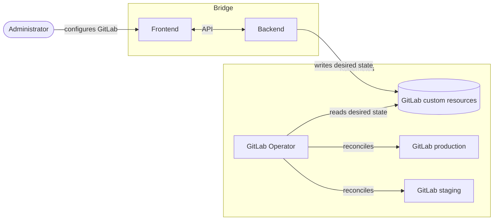

Date: 2026-07-06

## Status

Accepted

## Context

Bridge is a new component that works alongside GitLab Operator. It provides a user interface
through which administrators can interactively manage the operational lifecycle of GitLab and
its components in a modular fashion.

At a high level, administrators configure GitLab through Bridge, which persists the desired
state as custom resources. The Operator reads those resources and reconciles the actual GitLab
environments to match, keeping Bridge and the Operator decoupled from one another.

## Decision

### Tech stack

Bridge is built on top of GitLab Operator with a Vue-based frontend and a Go backend. The tech
stack decision is documented in [ADR 25](0025-bridge-tech-stack.md).

### Development

Both the Bridge backend and frontend are developed inside the GitLab Operator codebase to ease
bootstrapping and to speed up initial development. Neither component is part of the
customer-facing GitLab Operator releases until both are considered stable.

Especially early on, the new Operator custom resources will change frequently. Keeping
everything in a single repository avoids the overhead of propagating and syncing API changes
across multiple repositories. We nonetheless aim to keep the components as decoupled as
possible, so that splitting them into separate repositories remains an option in the future.

Additional CI noise was flagged as a risk of this approach which we plan to manage by
scoping jobs to trigger only when relevant directories change, or by running Bridge-related
work in a separate, non-blocking child pipeline so it does not slow down the core Operator CI.

### API

Bridge and the Operator are decoupled and communicate exclusively through custom resources.
The Operator introduces a new set of custom resources that supersede the existing
`apps.gitlab.com/v1beta1` custom resource with a more structured model.

The API design is documented in [ADR 24](0024-operator-custom-resources.md).

## Consequences

- Developing Bridge inside the GitLab Operator repository keeps the two projects in sync and
  lowers the initial overhead, at the cost of a larger codebase that mixes operator, backend,
  and frontend concerns. We will need clear boundaries and build tooling to keep them separate,
  and to preserve the option of splitting them into separate repositories later.
- Sharing a repository adds CI noise, which we plan to contain by scoping jobs to the directories
  they depend on or by moving Bridge work into a separate, non-blocking child pipeline.
- Excluding Bridge from customer-facing releases until it is stable lets us iterate quickly
  without committing to backwards compatibility, but means the component is not exercised by
  end users during early development.
- Decoupling Bridge and the Operator through custom resources keeps their contract explicit and
  allows either side to evolve independently.
