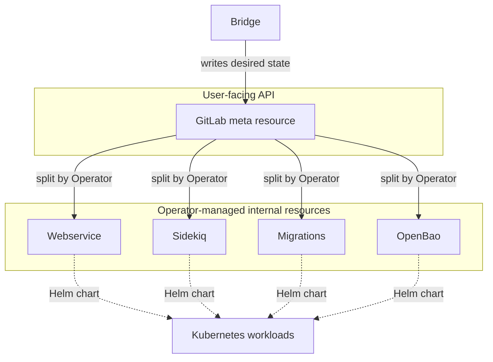

Date: 2026-07-06

## Status

Accepted

## Context

[ADR 23](0023-operator-bridge.md) establishes that Bridge and GitLab Operator are decoupled and
communicate exclusively through custom resources. To support this, the Operator needs a new API
that models the settings Bridge exposes to administrators.

The existing `apps.gitlab.com/v1beta1` custom resource accepts a free-form set of Helm chart
values ([ADR 4](0004-integration-of-the-gitlab-chart.md)) and does not provide the structured,
well-defined fields Bridge requires to drive the UI and validate input. [ADR 17](0017-structured-spec-for-gitlab-cr.md)
already committed to a structured specification for the GitLab custom resource; this ADR builds
on that direction and defines how the resources are structured to serve Bridge.

## Decision

We introduce a new set of structured custom resource definitions that accommodate the needs of
Bridge. The API is shaped by the following decisions:

- **Structured fields.** The new API exposes structured, typed fields that correspond directly
  to the settings available in Bridge. This gives Bridge a well-defined contract to read from and
  write to, and allows the Operator to validate configuration at the API level.
- **Helm charts at reconciliation time.** The Operator continues to use the GitLab Helm charts to
  reconcile the desired state, as it does today. The structured resources are translated into
  chart values internally; the charts remain the deployment mechanism.
- **User-facing meta resource.** A single user-facing "meta" GitLab resource corresponds to the
  GitLab umbrella chart. This is the resource Bridge writes to, and it represents the GitLab
  instance as a whole.
- **Operator-managed internal resources.** The Operator splits the meta resource into smaller,
  internal resources that are not customer-facing. Each internal resource owns one component and
  is reconciled independently, which keeps reconciliation modular and enables us to potentially
  replace some components with [Fairway-based](https://gitlab.com/gitlab-com/gl-infra/platform/runway/fairway)
  Helm charts later on.
- **Initial set of internal resources.** The initial internal resources are `Webservice`,
  `Sidekiq`, `Migrations`, and `OpenBao`. The set is expected to grow as more components are
  brought under the structured API.
- **Compatibility.** Existing installations based on the `apps.gitlab.com/v1beta1` custom
  resource will need a path to the new meta resource. A conversion webhook or other automated
  migration approaches will be explored once the API definition has settled.

## Consequences

- Bridge interacts only with the user-facing meta resource, keeping its contract stable and
  independent of how the Operator decomposes the work internally.
- The Operator can evolve the internal resources — adding, splitting, or renaming them — without
  changing the user-facing API, as long as the meta resource is preserved.
- Splitting components into dedicated internal resources allows the Operator to reconcile them
  independently, at the cost of additional resources to manage and reason about.
- Retaining the Helm charts as the reconciliation mechanism avoids re-implementing GitLab
  deployment logic, but ties the structured API to what the charts can express.
- The new API supersedes `apps.gitlab.com/v1beta1`. A migration path from the old resource to the
  structured meta resource — such as a conversion webhook or another automated approach — will be
  explored once the API definition has settled.
